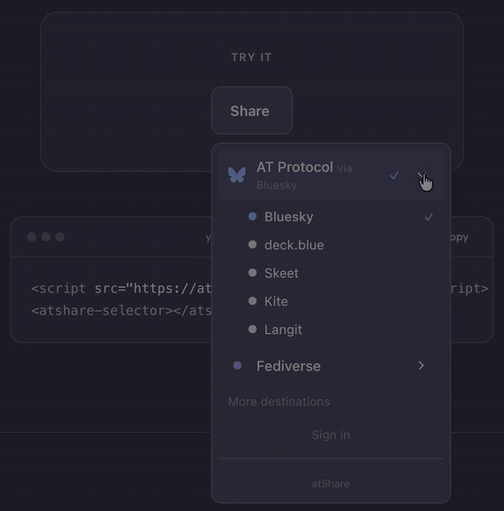

# @Share

[](https://www.npmjs.com/package/@atshare/selector)
[](https://bundlephobia.com/package/@atshare/selector)
[](https://github.com/rmichaelthomas/atshare)
[](https://github.com/rmichaelthomas/atshare/blob/main/LICENSE)

**One button to reach them all.**

A share button that lets people pick their network — and remembers their choice across every site.

<p align="center">
  
</p>

---

## Install

```html
<script src="https://atshare.social/dist/atshare-selector.js" defer></script>
<atshare-selector></atshare-selector>
```

That's it. Two lines. The selector reads the user's `social.atshare.preference` record from their PDS to pre-select their preferred destination.

---

## The Problem

Every "Share to Bluesky" button on the web hardcodes `bsky.app` as the destination. If your audience is on Blacksky, deck.blue, or any other AT Protocol client, the button doesn't work for them. Same problem on the Fediverse — "Share to Mastodon" assumes a single instance.

atShare fixes this.

---

## How It Works

1. **Embed** — Add `<atshare-selector>` to your page
2. **Click** — Your audience clicks the share button
3. **Pick** — They choose their network from the selector
4. **Remember** — Their preference is saved to their own PDS
5. **Everywhere** — The next site running atShare already knows their choice

---

## Features

**Every network, one button.**
Bluesky, Blacksky, Mastodon, LinkedIn, and more — your audience picks their destination from a single, clean selector.

**Preferences that follow.**
When someone authenticates, their preferred network is stored on their own PDS — not your site. Protocol-native and portable.

**One script tag. Done.**
A single web component with zero dependencies. Themeable to match your site. Works everywhere HTML works.

**Open source. Community-built.**
atShare composes existing open infrastructure — Microcosm for identity resolution, AT Protocol for preference storage. No tracking, no vendor lock-in, no accounts on our end. Built in the open, for the open web.

---

## Theming

atShare uses CSS custom properties for theming. Override them to match your site:

```css
atshare-selector {
  --atshare-accent: #64DFDF;        /* primary accent color */
  --atshare-accent-text: #1A1A2E;   /* text rendered on accent backgrounds */
  --atshare-bg: #ffffff;            /* popover/component background */
  --atshare-color: #0f172a;         /* primary text color */
  --atshare-border: #e2e8f0;        /* border color */
  --atshare-radius: 10px;           /* border radius */
  --atshare-muted: #6b7280;         /* secondary/muted text */
}
```

Dark mode example:

```css
atshare-selector {
  --atshare-bg: #1e293b;
  --atshare-bg-hover: #334155;
  --atshare-color: #f8fafc;
  --atshare-border: #334155;
  --atshare-muted: #94a3b8;
}
```

---

## Configuration

```html
<!-- Basic -->
<atshare-selector></atshare-selector>

<!-- Custom label -->
<atshare-selector label="Share this"></atshare-selector>

<!-- Specify content to share -->
<atshare-selector
  url="https://example.com/my-post"
  text="Check out this post">
</atshare-selector>
```

| Attribute | Description | Default |
|-----------|-------------|---------|
| `label` | Button text (default state) | "Share" |
| `url` | URL to share | Current page URL |
| `text` | Pre-filled share text | Page title |

---

## Adding a Network

The destination list lives in `destinations.json`. Want to add your AT Protocol client, Fediverse instance type, or traditional network? Open a PR.

```json
{
  "id": "your-network",
  "name": "Your Network",
  "type": "atproto",
  "intentUrl": "https://your-app.example/intent/compose?text={text}",
  "icon": "your-network-icon",
  "color": "#HEXCOLOR"
}
```

The ecosystem decides what atShare supports, not us. See [CONTRIBUTING.md](CONTRIBUTING.md) for details.

---

## Infrastructure

atShare runs on [Microcosm](https://microcosm.blue) for identity resolution — community-maintained AT Protocol infrastructure, not Bluesky's AppView. That's a deliberate choice. We're building for the protocol, not for one company's platform.

| Dependency | Purpose |
|------------|---------|
| [Microcosm Slingshot](https://microcosm.blue) | Handle → DID → PDS resolution |
| User's PDS | Preference record storage (`social.atshare.preference`) |
| AT Protocol OAuth | Authentication for preference read/write |

---

## The PDS Preference Record

The `social.atshare.preference` Lexicon stores a user's preferred share destination on their own PDS:

```json
{
  "$type": "social.atshare.preference",
  "primaryNetwork": "blacksky",
  "networks": [
    { "type": "atproto", "appView": "https://blacksky.app" },
    { "type": "activitypub", "instance": "https://mastodon.social" }
  ]
}
```

This is the innovation. The preference lives on the user's server, not yours. It follows them across every site running atShare.

---

## Contributing

atShare is open source and community-built. Contributions welcome:

- **Add a network** — PR to `destinations.json` (easiest contribution path)
- **Report bugs** — [Open an issue](../../issues/new?template=bug_report.md)
- **Request features** — [Open an issue](../../issues/new?template=feature_request.md)
- **Improve docs** — PRs welcome
- **Spread the word** — Share atShare with your community

See [CONTRIBUTING.md](CONTRIBUTING.md) for full guidelines.

---

## License

[MIT](LICENSE) — Free to use, modify, and distribute. The only requirement is including the license notice.

---

<p align="center">
  <strong>@Share</strong><br>
  <em>This is assembly, not invention.</em><br>
  <a href="https://atshare.social">atshare.social</a>
</p>
